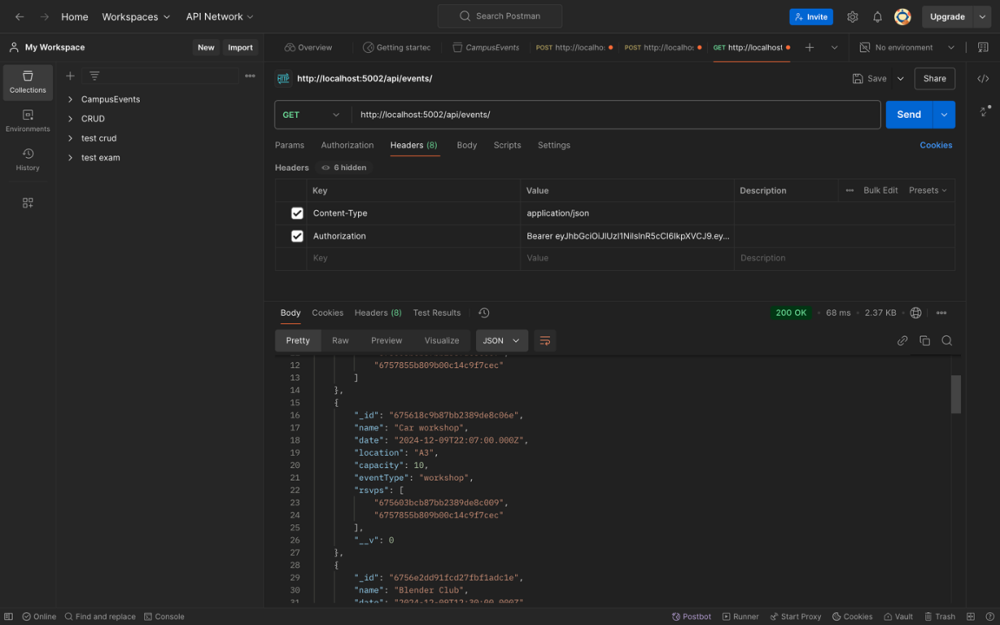

# Campus Events Platform - Backend

## Project Overview
This is the backend server for the Campus Events platform. It provides RESTful APIs to support event management, user authentication, and other core functionalities required by the frontend application. Built with Node.js and Express, it handles data persistence, business logic, and security features.

## Feature Checklist

### API Endpoints
- [ ] User Authentication
  - [ ] POST /api/auth/register
  - [ ] POST /api/auth/login
  - [ ] POST /api/auth/logout
  - [ ] POST /api/auth/reset-password

- [ ] Event Management
  - [ ] GET /api/events
  - [ ] POST /api/events
  - [ ] PUT /api/events/:id
  - [ ] DELETE /api/events/:id
  - [ ] GET /api/events/:id

- [ ] User Management
  - [ ] GET /api/users/profile
  - [ ] PUT /api/users/profile
  - [ ] GET /api/users/:id/events
  - [ ] POST /api/users/rsvp

### Database Models
- [ ] User Model
- [ ] Event Model
- [ ] RSVP Model
- [ ] Category Model

### Security Features
- [ ] JWT Authentication
- [ ] Password Hashing
- [ ] Rate Limiting
- [ ] Input Validation
- [ ] CORS Configuration

## Installation Instructions

### Prerequisites
- Node.js (v14 or higher)
- MongoDB (v4.4 or higher)
- npm (v6 or higher)

### Local Setup
1. Clone the repository

### Backend Deployment Link
https://campus-event-managementbackend.onrender.com

## API Endpoint Documentation

### Authentication Endpoints

#### Register User

*POST /api/auth/register - Create a new user account*

#### Login User

*POST /api/auth/login - Authenticate user and receive JWT token*

### Event Management Endpoints

#### Create Event

*POST /api/events/create - Create a new event (Admin only)*

#### Get All Events

*GET /api/events - Retrieve all events with optional filters*

#### Delete Event

*DELETE /api/events/:id - Remove an event (Admin only)*
